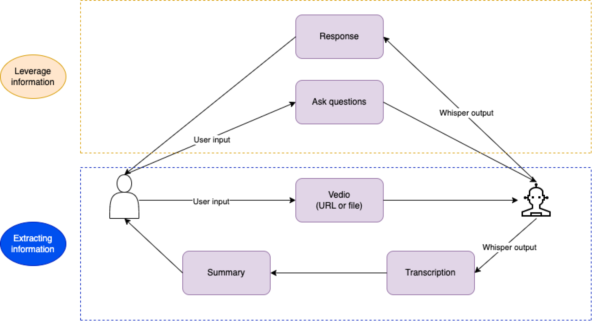

# Whisper: Your AI-Powered YouTube Companion

## Overview
Whisper is an advanced front-end project designed to streamline your YouTube experience, making it up to 100x faster. This project harnesses the power of AI to increase your efficiency, delivering a seamless and innovative approach to consuming content. Whisper is built with HTML, CSS, JavaScript, and jQuery, offering a sleek and intuitive user interface.

This project mainly includes the following web pages:
- Index (homepage)
- Login
- Signup
- History
- Result
- Upload
- Price

Whisper is perfect for:
- **Education**: Speed up learning by quickly summarizing educational content.
- **Workplace**: Save time on research and get answers to your queries in a snap.
- **Brainstorming**: Generate ideas faster by quickly summarizing and comparing multiple videos.

## Workflow

The Whisper workflow comprises the following steps:

1. **YouTube URL**: Input your desired YouTube video URL.
2. **Video**: Whisper retrieves the video data.
3. **Audio**: The video's audio track is extracted.
4. **Transcription**: Whisper transcribes the audio into text.
5. **Embedding**: The transcript is processed and embedded into the application.
6. **Summary**: Whisper generates a summary of the transcript.
7. **Compare Similarity**: Whisper can compare the similarity between questions and transcription.
8. **Answer Questions**: Pose questions about the video content, and Whisper will answer them based on its comprehensive understanding of the video.

## Reference
Additional detailed references about Whisper will be added here.

## Contact
Junchen You (47704554)
Github repo for backend of Whisper: https://github.com/jasonthewhale/Whisper
